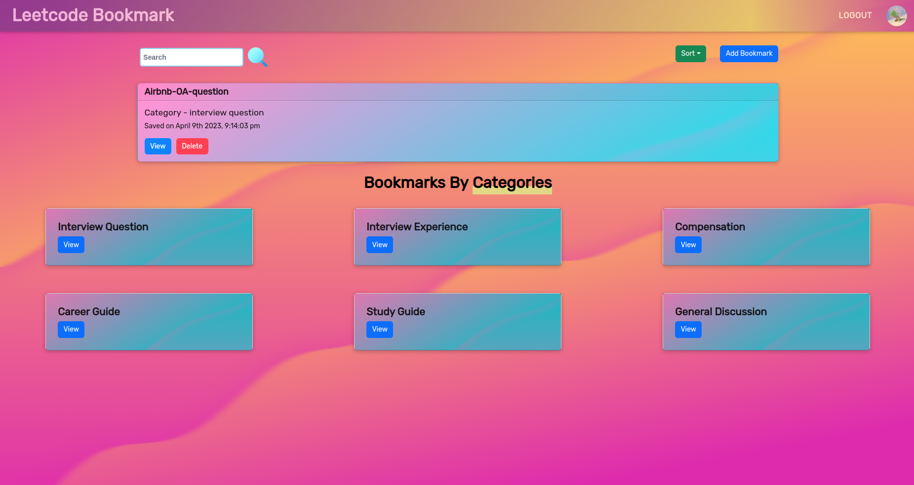
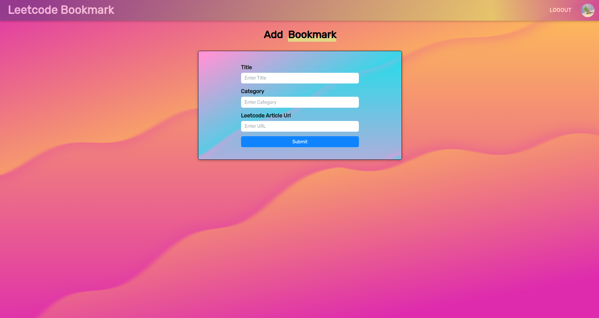

# leetcode-bookmark
Chrome extension which helps you to save your favourite articles from leetcode to the leetcode-bookmark website

[](https://forthebadge.com)
[](https://forthebadge.com)





## Demo

https://transfer-music.vercel.app/

Note : Install the leetcode bookmark extension to use this website, or you can add articles manually on the site.


## Run Locally

Clone the project

```bash
  https://github.com/Abhinav2011/leetcode-bookmark
```

Go to the project directory

```bash
  cd leetcode-bookmark
```

Install dependencies

```bash
  npm install
```

Run the website

```bash
  npm start
```


## Links

## 🔗 Links
[](https://my-portfolio-flax-kappa.vercel.app/)

[](https://www.linkedin.com/in/abhinav-kumar-904254195/)
